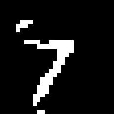

# MNIST Digits Classififcation with CNN
### 模型基本参数
本次作业，采用CNN进行MNIST手写数字的识别，采用了两层“Convolution-Pooling-Rule”的神经网络，最后再加上一层Linear层的模型，具体参数为：
* 卷积核维度：9×9
* 第一层卷积核个数：9
* 第二层卷积核个数：9
* learning_rate：0.0005
* weight_decay：0.001
* momentum：0.9
* batch_size：96
* max_iter：10000

### 训练结果
本人选用模型的参数较多，因此训练时间较长，差不多用了两个小时的时间，才最终完成本次训练，matlab的输出信息见result文件夹。可以从图中看到，最终test的准确可以达到99%，loss的值也保持在很低的水平。最提的信息可以见result文件夹。
##### 训练中的loss随迭代次数的变化曲线

##### 训练中测试的loss随迭代次数的变化曲线

##### 训练中测试的acc随迭代次数的变化曲线

### 卷积可视化效果
##### 样例一
原图如下所以：

第一次能卷积后的效果为：

##### 样例二
原图如下所以：

第一次能卷积后的效果为：

##### 样例三
原图如下所以：

第一次能卷积后的效果为：

##### 样例四
原图如下所以：

第一次能卷积后的效果为：

从上几个样例可以明显看出，第一层卷积中的第一、第四、第五个卷积结果并没有发挥作用，其实可以考虑在实际中去除，但是训练时间过于漫长，而且我觉得结果还可以，就没哟继续进行了。

### 与MLP的比较
- 首先，CNN神经网络的训练时长大大长于MLP神经网络，这点是有目共睹的，因为在CNN神经网络训练过程中需要计算和更新的参数大大多于MLP，主要在于卷积计算过程中时间复杂度很大。

- CNN神经网络的过拟合现象明显好于MLP神经网络，在实际训练过程中，CNN的训练准确率差不多可以达到99.5%，测试的准确率可以达到99%；而MLP的训练时候准确率可以达到99.7%，但是测试的准确率只能有98.5%。原因很可能是因为CNN的层间不是全连接，其次是CNN处理图像的能力就是天生强于MLP。
